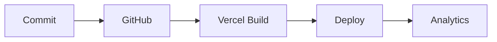

# 🛠️ Guia de Desenvolvimento - Creative AI Studio

## 📋 Índice

- [Configuração do Ambiente](#configuração-do-ambiente)
- [Estrutura do Projeto](#estrutura-do-projeto)  
- [Workflow de Desenvolvimento](#workflow-de-desenvolvimento)
- [Deploy e CI/CD](#deploy-e-cicd)
- [Monitoramento e Analytics](#monitoramento-e-analytics)
- [Troubleshooting](#troubleshooting)

## 🚀 Configuração do Ambiente

### Pré-requisitos

```bash
Node.js 20+
npm/yarn/pnpm
Git
```

### Instalação

```bash
# Clone o repositório
git clone https://github.com/M1n1h4ck3r/creative-ai-studio.git
cd creative-ai-studio

# Instale as dependências
npm install

# Configure as variáveis de ambiente
cp .env.example .env.local
```

### Variáveis de Ambiente Essenciais

```bash
# Supabase
NEXT_PUBLIC_SUPABASE_URL=your-supabase-url
NEXT_PUBLIC_SUPABASE_ANON_KEY=your-supabase-anon-key
SUPABASE_SERVICE_ROLE_KEY=your-service-role-key

# Segurança
JWT_SECRET=your-jwt-secret-64-chars
ENCRYPTION_KEY=your-32-char-encryption-key

# Provedores de IA
GEMINI_API_KEY=your-gemini-api-key
OPENAI_API_KEY=your-openai-api-key
REPLICATE_API_TOKEN=your-replicate-token
```

## 📁 Estrutura do Projeto

```
src/
├── app/                    # Next.js 15 App Router
│   ├── api/               # API routes
│   │   ├── generate/      # Geração de imagens
│   │   ├── api-keys/      # Gerenciamento de API keys
│   │   └── estimate-cost/ # Estimativa de custos
│   ├── auth/             # Páginas de autenticação
│   ├── dashboard/        # Dashboard principal
│   └── layout.tsx        # Layout global
├── components/           # Componentes React
│   ├── ui/              # Componentes shadcn/ui
│   ├── ImageGenerator.tsx
│   ├── ApiKeyConfig.tsx
│   └── ErrorBoundary.tsx
├── contexts/            # Context providers
│   ├── AuthContext.tsx
│   └── ApiKeyContext.tsx
├── lib/                 # Utilitários e configurações
│   ├── providers/       # Integrações com IA
│   │   ├── gemini.ts
│   │   ├── openai.ts
│   │   └── manager.ts
│   ├── analytics.ts     # Sistema de analytics
│   ├── supabase.ts     # Cliente Supabase
│   └── encryption.ts   # Criptografia de API keys
└── types/              # Definições TypeScript
    └── supabase.ts
```

## 🔄 Workflow de Desenvolvimento

### Branches

- **`master`**: Código de produção estável
- **`develop`**: Branch de desenvolvimento principal
- **`feature/*`**: Features específicas
- **`hotfix/*`**: Correções urgentes

### Fluxo de Trabalho

1. **Criar feature branch**
```bash
git checkout develop
git pull origin develop
git checkout -b feature/nova-funcionalidade
```

2. **Desenvolver e testar**
```bash
npm run dev  # Servidor de desenvolvimento
npm run lint # Verificar linting
npm run type-check # Verificar tipos
```

3. **Commit seguindo convenção**
```bash
git add .
git commit -m "feat: adicionar nova funcionalidade

- Implementar componente X
- Adicionar testes para Y
- Configurar Z"
```

4. **Criar Pull Request**
```bash
git push origin feature/nova-funcionalidade
# Abrir PR no GitHub: develop ← feature/nova-funcionalidade
```

### Scripts Disponíveis

```bash
npm run dev          # Desenvolvimento (porta 3000)
npm run build        # Build de produção
npm run start        # Executar build
npm run lint         # ESLint
npm run type-check   # TypeScript check
```

## 🚀 Deploy e CI/CD

### Pipeline Automático



### Ambientes

- **Produção**: `master` → https://creative-ai-studio-96w30bupf-luccas-6924s-projects.vercel.app
- **Preview**: Pull Requests → URLs temporárias
- **Development**: Local → http://localhost:3000

### Configuração do Vercel

As seguintes variáveis devem estar configuradas no Vercel:

```bash
# Essenciais
NEXT_PUBLIC_SUPABASE_URL
NEXT_PUBLIC_SUPABASE_ANON_KEY
SUPABASE_SERVICE_ROLE_KEY
JWT_SECRET
ENCRYPTION_KEY

# Opcionais
NEXT_PUBLIC_SENTRY_DSN
NEXT_PUBLIC_GA_ID
```

## 📊 Monitoramento e Analytics

### Sistema de Analytics

```typescript
import { analytics } from '@/lib/analytics'

// Rastrear geração de imagem
analytics.imageGeneration.started('gemini', prompt)
analytics.imageGeneration.completed('gemini', duration, true)

// Rastrear ações do usuário
analytics.user.apiKeyAdded('openai')
analytics.user.templateUsed('creative-template')
```

### Error Boundary

O sistema inclui captura automática de erros:

```typescript
// Capturar erro manualmente
import { captureError } from '@/lib/analytics'

try {
  // código que pode falhar
} catch (error) {
  captureError(error, 'context-info')
}
```

### Monitoramento de Performance

```typescript
import { measurePerformance } from '@/lib/analytics'

// Medir performance de operação
const result = await measurePerformance('image-generation', async () => {
  return await generateImage(options)
})
```

## 🐛 Troubleshooting

### Problemas Comuns

#### 1. Erro de Supabase Connection
```bash
Error: supabaseUrl is required
```
**Solução**: Verificar variáveis de ambiente do Supabase

#### 2. TypeScript Errors
```bash
npm run type-check
# Corrigir erros encontrados
```

#### 3. Build Failures
```bash
npm run build
# Verificar logs para identificar problemas
```

#### 4. API Key Encryption Issues
```bash
Error: Invalid encryption key
```
**Solução**: Verificar ENCRYPTION_KEY (deve ter exatamente 32 caracteres)

### Logs e Debug

#### Desenvolvimento
```bash
# Console do navegador - logs detalhados
# Verificar Network tab para chamadas API
```

#### Produção
```bash
# Vercel Dashboard → Functions → Logs
# Sentry (se configurado) → Error tracking
```

### Performance Issues

1. **Imagens lentas**
   - Verificar tamanho das imagens
   - Usar Next.js Image component
   - Implementar lazy loading

2. **API lenta**
   - Verificar timeout das funções
   - Otimizar queries do Supabase
   - Implementar cache quando possível

## 📚 Recursos Adicionais

### Documentação

- [Next.js 15](https://nextjs.org/docs)
- [Supabase](https://supabase.com/docs)
- [Vercel](https://vercel.com/docs)
- [shadcn/ui](https://ui.shadcn.com)

### APIs de IA

- [Google Gemini](https://ai.google.dev/docs)
- [OpenAI](https://platform.openai.com/docs)
- [Replicate](https://replicate.com/docs)

### Ferramentas

- **Design**: Figma, Adobe XD
- **Code**: VSCode + extensões recomendadas
- **Testing**: Jest, Cypress (futuro)
- **Monitoring**: Vercel Analytics, Sentry

---

## 🤝 Contribuição

1. Fork o repositório
2. Crie sua feature branch (`git checkout -b feature/AmazingFeature`)
3. Commit suas mudanças (`git commit -m 'Add some AmazingFeature'`)
4. Push para a branch (`git push origin feature/AmazingFeature`)
5. Abra um Pull Request

**Lembre-se**: Todo código deve passar pelos checks de linting e TypeScript antes do merge.

---

**🎯 Objetivo**: Manter código limpo, bem documentado e facilmente mantível para toda a equipe.