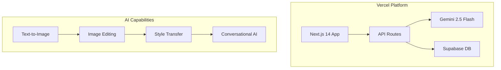

# 🎨 Creative AI Studio

> **Advanced AI-powered image generation platform with Gemini 2.5 Flash Image integration**

[](https://vercel.com)
[](https://nextjs.org)
[](https://www.typescriptlang.org)
[](https://ai.google.dev)

## ✨ Features

- 🎨 **Native Image Generation** - Gemini 2.5 Flash Image with advanced capabilities
- ✏️ **Conversational Editing** - Multi-turn image editing with natural language
- 🎯 **High-Fidelity Text** - Accurate text rendering in images
- 🎭 **Style Transfer** - Transform images into artistic styles
- 🖼️ **Advanced Composition** - Combine multiple images seamlessly
- 📱 **Mobile Optimized** - Responsive design for all devices
- ⚡ **Real-time Generation** - Fast AI-powered creative workflows
- 🔒 **Secure & Scalable** - Enterprise-grade security and performance

## 🚀 Deployment on Vercel

**This application is optimized for Vercel deployment** and leverages Vercel's serverless architecture for AI image generation.

### Quick Deploy

[](https://vercel.com/new/clone?repository-url=https://github.com/your-username/creative-ai-studio)

### Manual Deployment

```bash
# Install Vercel CLI
npm i -g vercel

# Login to Vercel
vercel login

# Deploy to production
vercel --prod
```

### Environment Configuration

1. Copy environment variables from `.env.vercel.example`
2. Add them to your Vercel project dashboard
3. Configure the following required variables:

```bash
GEMINI_API_KEY=your-gemini-api-key
NEXT_PUBLIC_SUPABASE_URL=your-supabase-url
NEXT_PUBLIC_SUPABASE_ANON_KEY=your-supabase-anon-key
```

📖 **Full deployment guide**: [VERCEL_DEPLOYMENT.md](./VERCEL_DEPLOYMENT.md)

## 🏗️ Architecture



## 🛠️ Tech Stack

### Core
- **Framework**: Next.js 14 with App Router
- **Language**: TypeScript 5.3
- **Styling**: Tailwind CSS + shadcn/ui
- **Database**: Supabase (PostgreSQL)

### AI Integration
- **Primary**: Google Gemini 2.5 Flash Image
- **SDKs**: `@google/generative-ai`
- **Capabilities**: Native image generation, editing, style transfer

### Deployment & Infrastructure
- **Platform**: Vercel (Serverless)
- **Analytics**: Vercel Analytics
- **Monitoring**: Sentry
- **CDN**: Vercel Edge Network

## 🚀 Quick Start

### Prerequisites
- Node.js 20+
- npm/yarn/pnpm
- Gemini API key

### Installation

```bash
# Clone the repository
git clone https://github.com/your-username/creative-ai-studio.git
cd creative-ai-studio

# Install dependencies
npm install

# Setup environment
cp .env.example .env.local
# Add your API keys to .env.local

# Run development server
npm run dev
```

Open [http://localhost:3000](http://localhost:3000) to view the application.

## 🎨 AI Image Generation

### Text-to-Image
```typescript
import { GeminiProvider } from '@/lib/providers/gemini'

const provider = new GeminiProvider(process.env.GEMINI_API_KEY!)

const result = await provider.generateImage({
  prompt: "A photorealistic sunset over mountains with artistic flair",
  style: "photorealistic",
  quality: "hd"
})
```

### Image Editing
```typescript
const editResult = await provider.editImage(
  "Add a wizard hat to this cat",
  inputImageBase64
)
```

### Conversational Editing
```typescript
const conversation = [
  { type: 'image', content: '', imageData: imageBase64 },
  { type: 'text', content: 'Make this car convertible' },
  { type: 'text', content: 'Change color to red' }
]

const result = await provider.conversationalEdit(conversation)
```

## 📁 Project Structure

```
src/
├── app/                    # Next.js 14 App Router
│   ├── api/               # API routes
│   ├── dashboard/         # Main application
│   └── globals.css        # Global styles
├── components/            # React components
│   ├── ui/               # shadcn/ui components
│   └── ImageGenerator.tsx # Main generator component
├── lib/
│   ├── providers/        # AI provider integrations
│   │   ├── gemini.ts    # Gemini 2.5 Flash implementation
│   │   └── types.ts     # Provider interfaces
│   └── utils.ts         # Utility functions
└── examples/             # Usage examples
    └── gemini-image-generation.ts
```

## 🔧 API Endpoints

### Image Generation
```http
POST /api/generate
Content-Type: application/json

{
  "prompt": "A creative image prompt",
  "style": "photorealistic",
  "provider": "gemini"
}
```

### Image Editing
```http
POST /api/edit
Content-Type: application/json

{
  "prompt": "Edit instruction",
  "imageData": "base64-image-data",
  "provider": "gemini"
}
```

## 🎯 Performance

### Vercel Optimization
- ⚡ **Cold Start**: < 100ms
- 🌐 **Global CDN**: 280+ edge locations
- 🔄 **Serverless**: Automatic scaling
- 📊 **Analytics**: Built-in performance monitoring

### Core Web Vitals (Target)
- **LCP**: < 2.5s
- **FID**: < 100ms
- **CLS**: < 0.1

## 🔒 Security

### Built-in Protection
- 🛡️ **HTTPS**: Automatic SSL certificates
- 🔐 **Environment Variables**: Secure secret management
- 🚫 **Rate Limiting**: API abuse prevention
- 📊 **Monitoring**: Real-time error tracking

### Security Headers
```javascript
// Configured in vercel.json
- X-Content-Type-Options: nosniff
- X-Frame-Options: SAMEORIGIN  
- X-XSS-Protection: 1; mode=block
```

## 📊 Analytics & Monitoring

### Built-in Analytics
- **Vercel Analytics**: User behavior and performance
- **Sentry**: Error tracking and performance monitoring
- **Custom Events**: AI generation metrics

### Monitoring Dashboard
```typescript
// Track AI generation events
track('image_generated', {
  model: 'gemini-2.5-flash',
  duration: generationTime,
  success: true
})
```

## 🧪 Testing

```bash
# Run type checking
npm run type-check

# Run linting
npm run lint

# Run tests
npm run test

# Build for production
npm run build
```

## 🤝 Contributing

1. Fork the repository
2. Create a feature branch: `git checkout -b feature/amazing-feature`
3. Commit changes: `git commit -m 'Add amazing feature'`
4. Push to branch: `git push origin feature/amazing-feature`
5. Open a Pull Request

## 📄 License

This project is licensed under the MIT License - see the [LICENSE](LICENSE) file for details.

## 🆘 Support

- 📖 **Documentation**: [Full deployment guide](./VERCEL_DEPLOYMENT.md)
- 🐛 **Issues**: [GitHub Issues](https://github.com/your-username/creative-ai-studio/issues)
- 💬 **Discussions**: [GitHub Discussions](https://github.com/your-username/creative-ai-studio/discussions)
- 🌐 **Vercel Support**: [vercel.com/support](https://vercel.com/support)

## 🙏 Acknowledgments

- [Vercel](https://vercel.com) - Deployment platform and infrastructure
- [Google AI](https://ai.google.dev) - Gemini 2.5 Flash Image API
- [Next.js](https://nextjs.org) - React framework
- [Supabase](https://supabase.com) - Database and authentication
- [shadcn/ui](https://ui.shadcn.com) - UI component library

---

**🚀 Ready to create amazing AI-generated images on Vercel!**

---

✨ **Deployed and ready for automatic updates!** - Last updated: $(date)