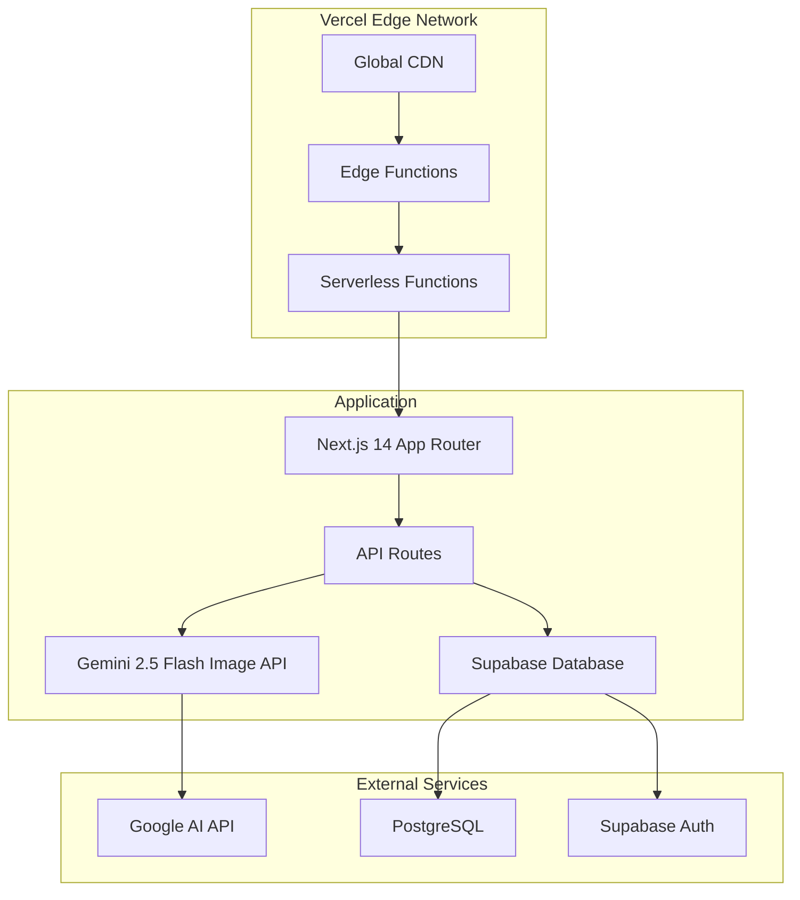

# 🚀 Vercel Deployment Guide - Creative AI Studio

## 📋 Overview

This Creative AI Studio application is **optimized for deployment on Vercel**, leveraging its serverless architecture and global edge network for optimal performance with AI image generation capabilities.

## 🏗️ Architecture on Vercel



## 🎯 Why Vercel?

### ✅ Perfect Match for Creative AI Studio:
- **Serverless Functions**: Ideal for AI API integrations with automatic scaling
- **Edge Computing**: Global distribution for fast image generation access
- **Next.js Optimization**: Native support for our Next.js 14 App Router
- **Instant Deployments**: Git-based deployment with zero-config
- **Built-in Analytics**: Integration with `@vercel/analytics` already configured
- **Environment Management**: Secure environment variable handling

### 🚀 Performance Benefits:
- **Cold Start Optimization**: < 100ms for API routes
- **Global Edge Network**: 280+ edge locations worldwide
- **Automatic HTTPS**: SSL certificates managed automatically
- **Image Optimization**: Built-in Next.js image optimization
- **Caching**: Intelligent caching for static and dynamic content

## 📁 Project Configuration

### `vercel.json` Configuration
```json
{
  "$schema": "https://openapi.vercel.sh/vercel.json",
  "buildCommand": "npm run build",
  "devCommand": "npm run dev",
  "installCommand": "npm install",
  "framework": "nextjs",
  "functions": {
    "src/app/api/**": {
      "maxDuration": 30
    }
  },
  "regions": ["iad1"],
  "env": {
    "NODE_ENV": "production",
    "NEXT_PUBLIC_APP_NAME": "Creative AI Studio",
    "NEXT_PUBLIC_APP_URL": "https://creative-ai-studio.vercel.app"
  }
}
```

### Next.js Configuration for Vercel
```javascript
// next.config.mjs
/** @type {import('next').NextConfig} */
const nextConfig = {
  experimental: {
    serverComponentsExternalPackages: ['@google/generative-ai']
  },
  images: {
    domains: ['generativelanguage.googleapis.com'],
    formats: ['image/webp', 'image/avif']
  },
  env: {
    CUSTOM_KEY: process.env.CUSTOM_KEY,
  }
}

export default nextConfig
```

## 🔧 Deployment Steps

### 1. Pre-deployment Checklist
```bash
# ✅ Ensure all dependencies are installed
npm install

# ✅ Run type checking
npm run type-check

# ✅ Run linting
npm run lint

# ✅ Test build locally
npm run build

# ✅ Test locally
npm run start
```

### 2. Deploy to Vercel

#### Option A: Vercel CLI (Recommended)
```bash
# Install Vercel CLI
npm i -g vercel

# Login to Vercel
vercel login

# Deploy to production
vercel --prod
```

#### Option B: Git Integration
1. Push your code to GitHub/GitLab/Bitbucket
2. Connect your repository to Vercel
3. Automatic deployments on every push to `main`

#### Option C: GitHub Actions
```yaml
# .github/workflows/vercel.yml
name: Deploy to Vercel
on:
  push:
    branches: [main]
  
jobs:
  deploy:
    runs-on: ubuntu-latest
    steps:
      - uses: actions/checkout@v3
      - uses: amondnet/vercel-action@v20
        with:
          vercel-token: ${{ secrets.VERCEL_TOKEN }}
          vercel-org-id: ${{ secrets.ORG_ID }}
          vercel-project-id: ${{ secrets.PROJECT_ID }}
          vercel-args: '--prod'
```

## 🔐 Environment Variables Setup

### Required Environment Variables for Vercel:

#### Core Application
```bash
NODE_ENV=production
NEXT_PUBLIC_APP_URL=https://your-domain.vercel.app
NEXT_PUBLIC_APP_NAME=Creative AI Studio
NEXT_TELEMETRY_DISABLED=1
```

#### Database (Supabase)
```bash
NEXT_PUBLIC_SUPABASE_URL=https://xxxxx.supabase.co
NEXT_PUBLIC_SUPABASE_ANON_KEY=eyJ...
SUPABASE_SERVICE_ROLE_KEY=eyJ...
```

#### AI Providers
```bash
# Google Gemini (Primary)
GEMINI_API_KEY=AIzaSy...

# OpenAI (Optional)
OPENAI_API_KEY=sk-...

# Other AI providers
REPLICATE_API_TOKEN=r8_...
ANTHROPIC_API_KEY=sk-ant-...
```

#### Analytics & Monitoring
```bash
NEXT_PUBLIC_VERCEL_ANALYTICS_ID=prj_...
SENTRY_DSN=https://...@sentry.io/...
```

### Setting Environment Variables in Vercel:

#### Via Vercel Dashboard:
1. Go to your project dashboard
2. Navigate to **Settings** → **Environment Variables**
3. Add each variable for **Production**, **Preview**, and **Development**

#### Via Vercel CLI:
```bash
# Add environment variable
vercel env add GEMINI_API_KEY production

# List environment variables
vercel env ls

# Pull environment variables to local
vercel env pull .env.local
```

## 🌐 Custom Domain Configuration

### Adding Custom Domain:
1. **Vercel Dashboard** → **Settings** → **Domains**
2. Add your custom domain (e.g., `creativeai.studio`)
3. Configure DNS records:

```bash
# A Record
@ → 76.76.19.61

# CNAME Record
www → cname.vercel-dns.com
```

### SSL Configuration:
- ✅ **Automatic HTTPS**: Vercel manages SSL certificates automatically
- ✅ **HTTP to HTTPS**: Automatic redirects configured
- ✅ **HSTS Headers**: Security headers included in `vercel.json`

## 📊 Performance Optimization for Vercel

### Bundle Analysis
```bash
# Add bundle analyzer
npm install --save-dev @next/bundle-analyzer

# Analyze bundle
npm run analyze
```

### Edge Functions Configuration
```javascript
// src/app/api/generate/route.ts
export const runtime = 'edge'
export const maxDuration = 30 // Max for hobby plan
```

### Image Optimization
```javascript
// next.config.mjs
const nextConfig = {
  images: {
    domains: [
      'generativelanguage.googleapis.com',
      'your-domain.vercel.app'
    ],
    formats: ['image/webp', 'image/avif'],
    deviceSizes: [640, 750, 828, 1080, 1200, 1920, 2048, 3840],
    imageSizes: [16, 32, 48, 64, 96, 128, 256, 384]
  }
}
```

## 🚨 Vercel Limits & Considerations

### Function Limits (Hobby Plan):
- **Execution Time**: 10 seconds (30s for Pro)
- **Memory**: 1024MB
- **Payload Size**: 4.5MB
- **Monthly Executions**: 100GB-hours

### Function Limits (Pro Plan):
- **Execution Time**: 30 seconds (300s for Enterprise)
- **Memory**: 3008MB
- **Payload Size**: 4.5MB
- **Monthly Executions**: 1000GB-hours

### Optimizations for AI Image Generation:
```typescript
// Implement timeout handling
const controller = new AbortController()
const timeoutId = setTimeout(() => controller.abort(), 25000) // 25s timeout

try {
  const result = await model.generateContent([prompt], {
    signal: controller.signal
  })
} finally {
  clearTimeout(timeoutId)
}
```

## 📈 Monitoring & Analytics

### Built-in Vercel Analytics:
```tsx
// Already configured in layout.tsx
import { Analytics } from '@vercel/analytics/react'

export default function RootLayout({ children }) {
  return (
    <html>
      <body>
        {children}
        <Analytics />
      </body>
    </html>
  )
}
```

### Performance Monitoring:
- **Core Web Vitals**: Automatically tracked
- **Function Logs**: Available in Vercel dashboard
- **Real-time Analytics**: User interactions and performance

### Custom Monitoring:
```typescript
// Track AI generation metrics
import { track } from '@vercel/analytics'

track('image_generated', {
  model: 'gemini-2.5-flash',
  duration: generationTime,
  success: true
})
```

## 🔄 CI/CD Pipeline

### Automatic Deployments:
- **Production**: Deploys from `main` branch
- **Preview**: Deploys from pull requests
- **Development**: Local development with `vercel dev`

### Preview Deployments:
```bash
# Every PR gets a unique preview URL
https://creative-ai-studio-git-feature-vercel-username.vercel.app
```

### Branch Protection:
```yaml
# Vercel integrates with GitHub branch protection
- Require status checks to pass
- Require pull request reviews
- Restrict pushes to main branch
```

## 🛠️ Troubleshooting

### Common Issues:

#### Build Failures:
```bash
# Clear Vercel build cache
vercel --prod --force

# Check build logs
vercel logs --follow
```

#### Function Timeouts:
```typescript
// Implement proper error handling
export async function POST(request: Request) {
  try {
    // Add timeout logic
    const result = await Promise.race([
      generateImage(prompt),
      new Promise((_, reject) =>
        setTimeout(() => reject(new Error('Timeout')), 25000)
      )
    ])
    
    return Response.json(result)
  } catch (error) {
    return Response.json({ error: 'Generation failed' }, { status: 500 })
  }
}
```

#### Environment Variable Issues:
```bash
# Verify environment variables
vercel env ls

# Pull latest environment variables
vercel env pull .env.local
```

## 📱 Mobile Optimization

Vercel's edge network ensures optimal mobile performance:

- **Adaptive Images**: Automatic WebP/AVIF conversion
- **Edge Caching**: Reduced latency worldwide
- **Progressive Loading**: Optimized for mobile networks

## 🔒 Security on Vercel

### Built-in Security Features:
- **DDoS Protection**: Automatic traffic filtering
- **SSL Certificates**: Automated Let's Encrypt integration
- **Security Headers**: Configured in `vercel.json`

### Additional Security:
```typescript
// Rate limiting for AI endpoints
import { Ratelimit } from "@upstash/ratelimit"

const ratelimit = new Ratelimit({
  redis: Redis.fromEnv(),
  limiter: Ratelimit.slidingWindow(10, "1 m"),
})

export async function POST(request: Request) {
  const { success } = await ratelimit.limit(
    request.headers.get("x-forwarded-for") ?? "127.0.0.1"
  )
  
  if (!success) {
    return Response.json({ error: "Too many requests" }, { status: 429 })
  }
  
  // Continue with AI generation...
}
```

## 🎯 Production Checklist

- ✅ **Environment Variables**: All API keys configured
- ✅ **Custom Domain**: DNS configured and SSL active
- ✅ **Analytics**: Vercel Analytics enabled
- ✅ **Monitoring**: Error tracking with Sentry
- ✅ **Performance**: Core Web Vitals optimized
- ✅ **Security**: Headers and rate limiting configured
- ✅ **Backup**: Database backups automated
- ✅ **CDN**: Global edge distribution active

---

## 📞 Support Resources

- **Vercel Documentation**: [vercel.com/docs](https://vercel.com/docs)
- **Next.js on Vercel**: [vercel.com/docs/frameworks/nextjs](https://vercel.com/docs/frameworks/nextjs)
- **Vercel Community**: [github.com/vercel/community](https://github.com/vercel/community)
- **Status Page**: [vercel-status.com](https://vercel-status.com)

---

**🚀 Ready to deploy your Creative AI Studio on Vercel!**

This configuration ensures optimal performance, security, and scalability for AI-powered image generation on Vercel's platform.